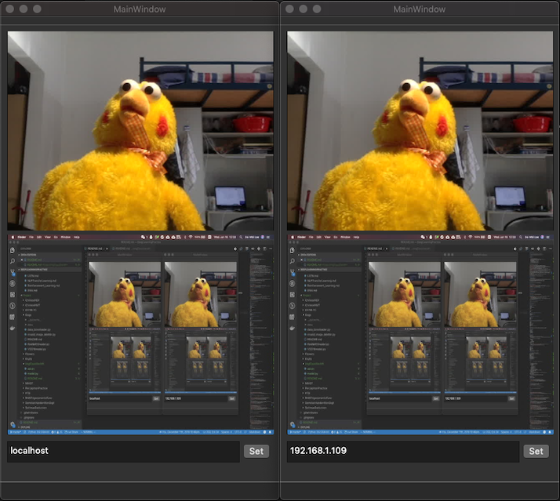
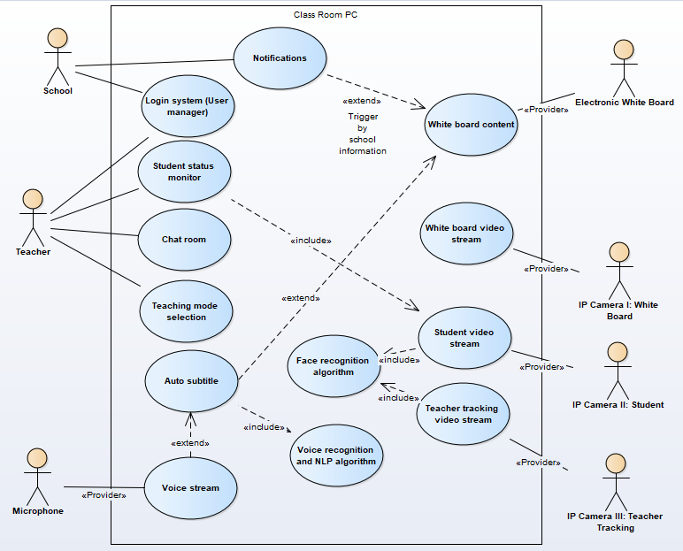
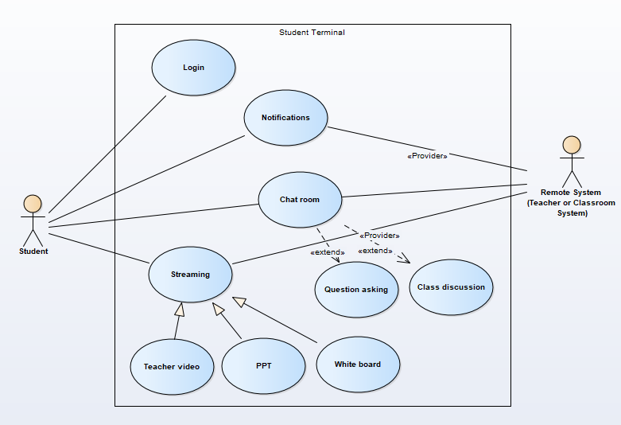
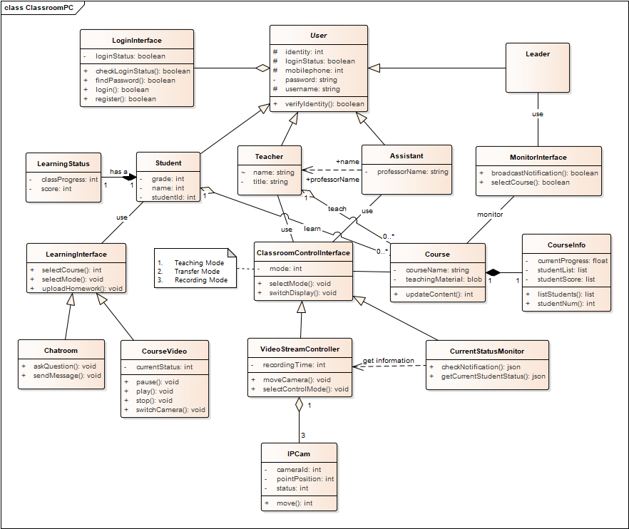
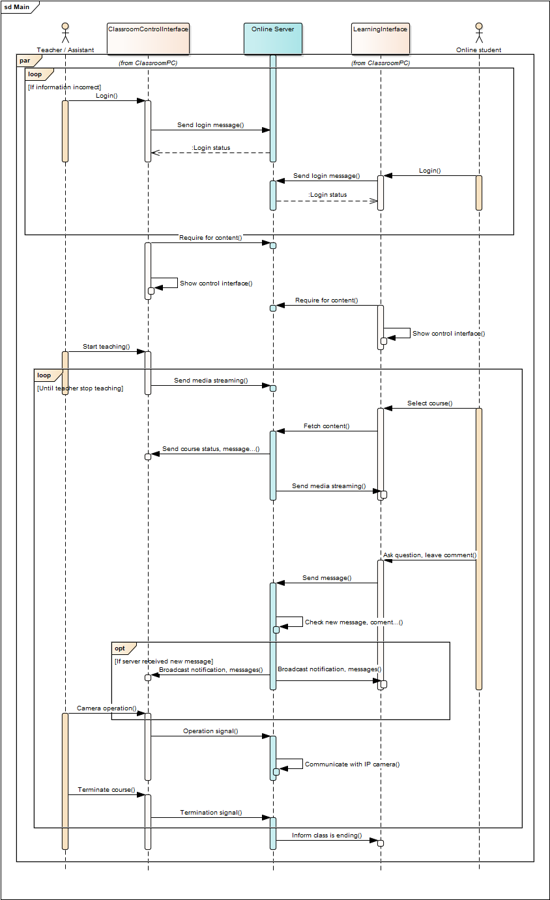
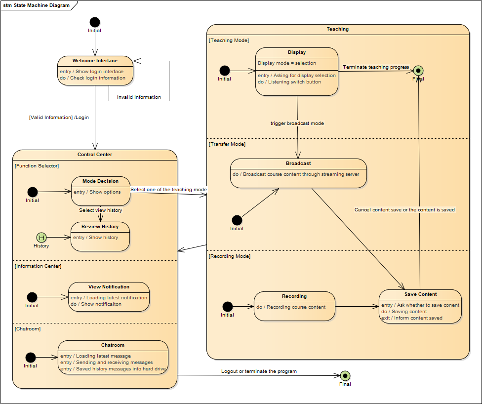

# IntelligentClassroom

A course project of The Advanced Object-Oriented Technology which offer interactive teaching service.

Purpose:

* Object-Oriented Analysis with UML Diagrams
* Object-Oriented Design / Programming with ffmpeg (for media stream) and Qt (for C++ GUI)

## Demo



```sh
# MacOS
cd MacDemo
# Start ffmpeg
./demo_start_ffmpeg.sh
# Start main program
open IntelligenceClassroom.app
# or (for open multiple applications)
./IntelligenceClassroom.app/Contents/MacOS/IntelligenceClassroom &

# Close ffmpeg
./find_and_kill.sh
```

## TODO

* [ ] ffmpeg Audio sound
* [ ] Make a portable package?!
* [ ] Chatroom

## UML Diagram

### Use Case Diagram

Classroom



Student



### Class Diagram



### Sequence Diagram

Teaching Part



### State Machine Diagram


